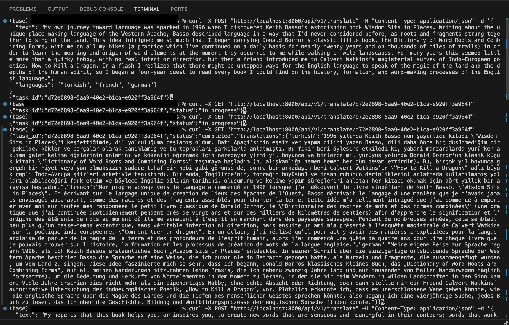

# Translation Service

This is a FastAPI-based application for translating text into multiple languages using OpenAI's GPT-4 model. The application stores translation tasks in a PostgreSQL database and processes them asynchronously.

## Features

- Submit text for translation into multiple languages.
- Check the status and results of translation tasks.
- Asynchronous processing of translation tasks using HTTP requests to the OpenAI API.

## Project Structure

- `app/`: Contains the main application code.
  - `main.py`: Defines the FastAPI application and endpoints.
  - `db.py`: Sets up the database connection and session.
  - `models.py`: Defines the database models.
  - `schemas.py`: Defines the Pydantic schemas for request and response validation.
  - `tasks.py`: Contains the asynchronous task processing logic.
  - `loging_config.py`: Configures logging for the application.
  - `prompt/`
    - `prompt_extract.py`: Handles the extraction of prompts from a YAML file.
    - `prompt.yaml`: Stores the system and user prompt
- `logs/`
  - `app.log`: The logs are stored in the logs/app.log file. This includes information about translation progress, errors, and other important events.
- `Dockerfile`: Defines the Docker image for the FastAPI application.
- `docker-compose.yml`: Defines the services for the application and the database.
- `requirements.txt`: Lists the Python dependencies.

## Getting Started

### Prerequisites

- Docker and Docker Compose installed on your machine.
- OpenAI API key.

### Setup

1. **Clone the repository:**

   ```bash
   git clone https://github.com/enesbasbug/FastAPI-Async-Translator
   cd FastAPI-Async-Translator
   ```

2. **Environment Variables:**

   Set your OpenAI API key in the `docker-compose.yml` file under the `environment` section for the `web` service:

   ```yaml
   environment:
     - DATABASE_URL=postgresql+asyncpg://postgres:postgres@db:5432/translate_db
     - OPENAI_API_KEY=your_openai_api_key_here
   ```

3. **Build and start the services:**

   ```bash
   docker-compose up --build
   ```

   This command will build the Docker images and start the services defined in the `docker-compose.yml` file.

### Endpoints

- **Submit a translation task:**

  ```bash
  curl -X POST "http://localhost:8000/api/v1/translate" -H "Content-Type: application/json" -d '{
    "text": "My own journey toward language was sparked in 1996 when I discovered Keith Basso’s astonishing book Wisdom Sits in Places. Writing about the unique place-making language of the Western Apache, Basso described language in a way that I’d never considered before, as roots and fragments strung together to sing of the land. This idea intrigued me so much that I began carrying Donald Borror’s classic little book, the Dictionary of Word Roots and Combining Forms, with me on all my hikes (a practice which I’ve continued on a daily basis for nearly twenty years and on thousands of miles of trails) in order to learn the meaning and origin of word elements at the moment they occurred to me while walking in wild landscapes. For many years this seemed little more than a quirky hobby, with no real intent or direction, but then a friend introduced me to Calvert Watkins’s magisterial survey of Indo-European poetics, How to Kill a Dragon. In a flash I realized that there might be untapped ways for the English language to speak of the magic of the land and the depths of the human spirit, so I began a four-year quest to read every book I could find on the history, formation, and word-making processes of the English language.",
    "languages": ["turkish", "french", "german"]
  }'
  ```

  Response:

  ```json
  {
    "task_id": "your-task-id"
  }
  ```

- **Check the status of a translation task:**

  ```bash
  curl -X GET "http://localhost:8000/api/v1/translate/{task_id}"
  ```

  Replace `{task_id}` with the actual task ID you received when submitting the translation task.

  Response:

  ```json
  {
    "task_id": "your-task-id",
    "status": "failed/in_progress"
  }

   or 
  
  {
    "task_id": "your-task-id",
    "status": "completed",
    "translations": {
      "turkish": "Translated text",
      "french": "Translated text",
      "german": "Translated text"
    }
  }
  ```

## Result;



